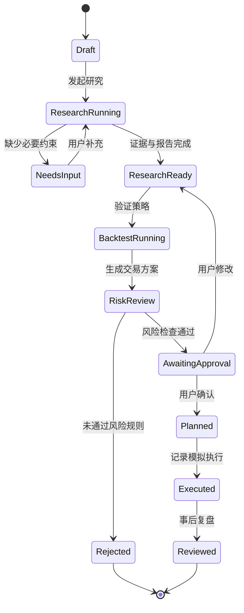
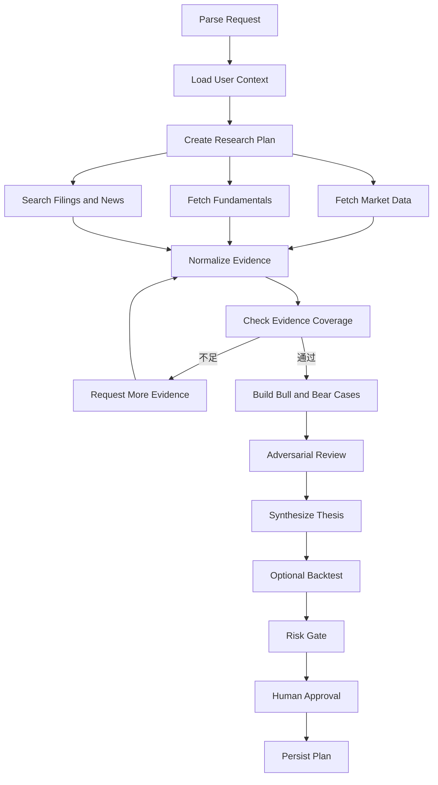
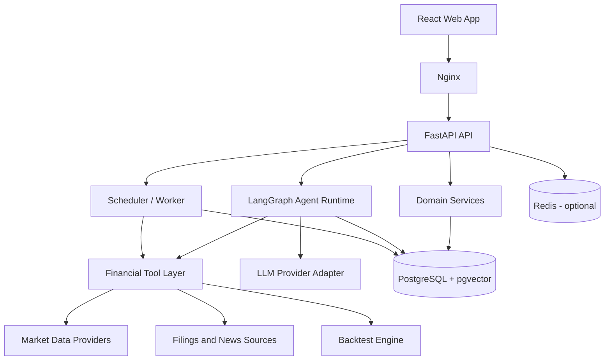

# AI Investment Decision Agent 详细设计方案

> 文档状态：Draft v1.0
> 项目阶段：作品集 MVP 设计
> 首个演示标的：Micron Technology（NASDAQ: MU）
> 目标市场：美股，后续扩展至加密资产
> 最后更新：2026-07-21

## 1. 文档目的

本文档定义 AI Investment Decision Agent 的产品范围、Agent 工作流、系统架构、数据模型、接口协议、评测方案、部署方式和迭代计划，作为后续开发、测试、演示和简历表达的统一依据。

本项目不是一个预测股价的聊天机器人，而是一个证据驱动的投资决策工作台。它将市场数据、公开资料、AI 投研、策略回测、风险控制、交易计划和事后复盘连接成可追踪、可解释、可评估的完整闭环。

## 2. 项目定义

### 2.1 产品名称

中文名称：AI 投资决策 Agent
英文名称：AI Investment Decision Agent
产品工作台名称：AI Trading Desk

### 2.2 一句话定位

> 面向美股个人投资者的证据驱动投研、交易计划与复盘 Agent。

### 2.3 核心价值

用户提出一个投资问题后，系统能够：

1. 理解研究目标和用户约束。
2. 制定可追踪的研究计划。
3. 调用行情、财务、公告、新闻和回测工具。
4. 将事实、推断和未知信息明确分离。
5. 输出多空观点、证伪条件和风险提示。
6. 根据账户风险预算生成仓位建议。
7. 经用户确认后保存为交易计划。
8. 在事后将真实结果与原计划对照复盘。

### 2.4 目标岗位适配

技术方向：

- AI 应用工程师 / Agent 工程师。
- 金融科技后端工程师。
- 量化开发 / 研究平台工程师。
- 交易系统 / 风控平台工程师。
- 数据平台工程师。

产品方向：

- AI 产品经理。
- 金融科技产品经理。
- 投研平台产品经理。
- 交易或风控产品经理。
- 数据产品经理。

## 3. 背景与当前状态

### 3.1 已有能力

当前代码库已经包含：

- React、TypeScript、Vite 前端。
- 自选股、行情摘要、K 线图和新闻展示。
- Gemini / DeepSeek 股票分析。
- 资产台账、账单、资产快照和投资日记。
- AI 复盘评价。
- 基于浏览器本地存储的数据持久化。

### 3.2 当前主要问题

1. 各页面是相互独立的原型，缺少统一业务主线。
2. 首页只挂载资产台账，行情、投研和复盘能力未形成统一导航。
3. 行情和 AI 请求由浏览器直接发起，API Key 存在暴露风险。
4. 数据主要保存在 `localStorage`，无法可靠查询、关联和审计。
5. AI 以单次文本生成为主，没有可恢复的 Agent 状态。
6. 缺少工具调用记录、证据对象、投资论点和交易计划等领域模型。
7. 缺少 Agent 评测集，无法回答“效果是否真的提升”。
8. 部分历史中文文本存在编码异常，需要在产品重构时统一修复。

### 3.3 演进目标

```text
个人投资前端工具
  -> 全栈投资工作台
  -> 有状态、可调用工具的投资决策 Agent
  -> 可评测、可审计、可持续复盘的 AI 金融产品
```

## 4. 目标与非目标

### 4.1 MVP 目标

- 支持美股单标的深度研究。
- 支持日线及以上周期行情。
- 支持公告、财务指标和新闻证据检索。
- 支持结构化研究报告和引用追踪。
- 支持三种基础策略回测。
- 支持交易风险预算和仓位计算。
- 支持模拟交易计划、人工确认和复盘。
- 保存完整 Agent 执行轨迹、模型信息和工具调用。
- 部署为可公开演示的全栈应用。

### 4.2 MVP 非目标

- 不连接券商执行真实交易。
- 不承诺收益，不输出确定性涨跌预测。
- 不做高频、分钟级或 Tick 级交易。
- 不做复杂期权定价与组合优化。
- 不在第一阶段实现完整社交、订阅或收费系统。
- 不在第一阶段同时支持多个国家市场。
- 不让 LLM 自行计算回测收益和风险指标。

## 5. 目标用户与需求

### 5.1 核心用户

具有一定投资经验、关注美股科技和 AI 产业链、希望建立纪律化研究与交易流程的个人投资者。

### 5.2 用户痛点

- 信息分散在行情软件、财报、新闻和社交媒体中。
- 容易先有结论再寻找证据。
- AI 回答常缺少时效性、引用和反方观点。
- 投资逻辑和实际买卖行为没有统一记录。
- 下单前缺少明确的最大亏损和退出条件。
- 复盘常停留在盈亏结果，没有检查决策过程。

### 5.3 核心用户故事

1. 作为投资者，我希望输入一个标的和问题，获得带来源的结构化研究报告。
2. 作为投资者，我希望系统主动寻找反方证据，避免只强化已有观点。
3. 作为投资者，我希望验证一个交易想法过去是否有效，而不是只听 AI 解释。
4. 作为投资者，我希望在计划买入前知道合理仓位和最坏损失。
5. 作为投资者，我希望保存当时的判断，事后知道自己错在事实、逻辑还是执行。
6. 作为面试官，我希望能查看 Agent 的执行轨迹、工具调用、评测结果和工程设计。

## 6. 核心业务闭环

### 6.1 黄金演示场景

用户输入：

> 美光财报后上涨，现在上车是否还来得及？重点分析 HBM 的必要性、存储周期是否被 AI 需求改变，以及未来 6 到 12 个月的风险收益比。我的账户净值 10 万美元，单笔最多亏损 1%。

系统执行：

1. 识别标的、研究主题、期限和风险预算。
2. 生成研究计划并展示当前进度。
3. 获取 MU 行情、估值和历史波动。
4. 获取财报、监管文件、管理层表述和相关新闻。
5. 建立 HBM、供需周期、资本开支和估值证据卡片。
6. 生成 Bull Case、Base Case 和 Bear Case。
7. 使用历史数据回测用户选择的进入规则。
8. 计算止损距离、最大股数、资金占用和盈亏比。
9. 经过风险门禁后生成模拟交易计划。
10. 用户确认或修改后保存计划。
11. 财报或持仓结束后启动 Review Agent，对照原计划复盘。

### 6.2 业务状态流



## 7. 产品信息架构

### 7.1 一级导航

1. Dashboard：市场、自选股、组合和 Agent 待办摘要。
2. Market：行情、K 线、财务、新闻和公告。
3. Research：Agent 研究任务、证据卡片和研究报告。
4. Strategy：策略模板、参数、回测结果和对比。
5. Risk：持仓、敞口、仓位计算和风险告警。
6. Journal：交易计划、执行记录、复盘和行为统计。
7. Agent Runs：执行历史、节点状态、工具调用和失败原因。

### 7.2 Dashboard

核心区域：

- 自选股及当日变化。
- 当前资产、现金、持仓和最大回撤。
- 最近研究任务。
- 待确认的交易计划。
- 风险告警。
- 今日需要复盘的交易。

Dashboard 只展示可行动信息，不承担复杂分析。

### 7.3 Research Workspace

页面布局：

- 左侧：研究任务列表和状态筛选。
- 中间：研究报告、情景分析和交易结论。
- 右侧：证据卡片、来源、Agent 轨迹和用户约束。

核心交互：

- 新建研究任务。
- 查看 Agent 当前步骤。
- 暂停、继续或取消任务。
- 要求补充证据或重新生成某一章节。
- 将研究结论转换为交易计划。
- 对单条结论标记“接受、质疑、忽略”。

### 7.4 Strategy Lab

MVP 策略：

- 均线交叉。
- 动量突破。
- RSI 均值回归。

参数包括：标的、时间范围、初始资金、手续费、滑点、信号参数、仓位规则和基准指数。

输出包括：累计收益、年化收益、最大回撤、夏普比率、胜率、盈亏比、Profit Factor、交易次数、权益曲线和交易明细。

### 7.5 Risk Center

核心功能：

- 单笔交易仓位计算。
- 单标的、行业和资产类别敞口。
- 现金和杠杆比例。
- 历史回撤和当前回撤。
- 风险规则配置。
- 计划通过或拒绝的原因。

### 7.6 Journal

核心对象：

- 交易前计划。
- 实际执行。
- 市场环境。
- 情绪与行为标签。
- 计划偏差。
- 事实、逻辑、风险和执行四类评分。
- 下一次必须遵守的行动规则。

## 8. Agent 总体设计

### 8.1 设计原则

1. 单一编排器负责状态推进，避免无意义的 Agent 群聊。
2. 数据获取、指标计算、回测和风险计算由确定性工具完成。
3. LLM 负责理解、规划、证据归纳、冲突分析和自然语言解释。
4. 每个关键结论必须关联证据，或明确标记为推断。
5. 交易计划必须经过风险节点和用户确认。
6. 每次执行可暂停、重试、恢复和审计。
7. Prompt、模型、工具版本和数据时间均需记录。

### 8.2 Agent 类型

MVP 实现三个逻辑 Agent，共用一个状态图：

#### Research Agent

负责理解问题、制定研究计划、检索资料、建立证据、生成多空论点和研究结论。

#### Risk Agent

负责读取研究结论、账户约束和回测结果，调用确定性风险工具，判断计划是否可接受。

#### Review Agent

负责对照原始研究、交易计划和实际结果，区分事实错误、逻辑错误、风险错误和执行错误。

Strategy Backtest 不实现为 Agent，而作为确定性的计算工具提供给 Research Agent 和 Risk Agent 调用。

### 8.3 Agent 状态模型

```python
class InvestmentAgentState(TypedDict):
    run_id: str
    user_id: str
    symbol: str
    question: str
    horizon: str
    as_of_time: str
    user_constraints: dict
    research_plan: list[dict]
    evidence_ids: list[str]
    missing_information: list[str]
    thesis: dict | None
    backtest_request: dict | None
    backtest_result_id: str | None
    risk_result: dict | None
    trade_plan_id: str | None
    approval_status: str | None
    errors: list[dict]
    current_node: str
```

`as_of_time` 是强制字段，所有行情、新闻、财务和研究结论必须说明数据截止时间，避免未来数据泄漏和时效混淆。

### 8.4 Research Agent 节点



### 8.5 节点职责

#### Parse Request

- 提取标的、时间范围、研究类型、关注主题和风险偏好。
- 检查标的是否存在。
- 对缺失但必要的参数使用用户默认配置。
- 只有当缺失信息会实质改变结果时才中断询问。

#### Create Research Plan

- 将问题拆成 3 到 8 个研究子任务。
- 指定每个任务所需工具和目标证据类型。
- 给出完成条件，而不是只生成自然语言大纲。

#### Normalize Evidence

- 将不同行情、公告和新闻结果统一为 Evidence 对象。
- 计算内容哈希并去重。
- 标记来源类型、发布时间、采集时间和可信度等级。

#### Check Evidence Coverage

检查以下维度是否有足够证据：

- 当前价格和历史波动。
- 收入、利润、现金流和资产负债表。
- 管理层指引或监管文件。
- 行业供需或核心业务驱动。
- 估值和市场预期。
- 主要风险与反方事实。

#### Adversarial Review

- 找出没有来源支撑的陈述。
- 找出同一结论中的证据冲突。
- 主动生成最强 Bear Case。
- 判断结论是否受到幸存者偏差、确认偏误或时间泄漏影响。
- 不能修复的问题进入 `known_unknowns`。

#### Risk Gate

- 不判断“股票好不好”，只判断计划是否符合用户风险规则。
- 风险计算必须使用服务端函数，不接受 LLM 自算结果。
- 未设置退出条件、止损距离为零、仓位超限或数据过期时拒绝计划。

### 8.6 人机协作节点

以下动作必须由用户确认：

- 保存正式交易计划。
- 修改账户级风险规则。
- 将模拟交易标记为已执行。
- 删除研究报告或历史记录。
- 未来若接入券商，任何真实订单都必须二次确认；MVP 不实现真实订单。

用户可在确认页修改入场价、止损、目标价和风险预算。任何修改都会触发风险工具重新计算。

## 9. Agent 工具设计

### 9.1 工具通用协议

每个工具都必须：

- 使用结构化输入和输出。
- 声明超时、重试和缓存策略。
- 返回 `source`、`as_of_time` 和 `freshness`。
- 记录调用耗时、状态和错误类型。
- 不向 LLM 返回不必要的原始大对象。

通用返回格式：

```json
{
  "success": true,
  "data": {},
  "source": "provider_name",
  "as_of_time": "2026-07-21T14:00:00Z",
  "freshness": "realtime_or_delayed",
  "warnings": [],
  "error": null
}
```

### 9.2 Market Data Tool

输入：

```json
{
  "symbol": "MU",
  "timeframe": "1d",
  "start": "2024-01-01",
  "end": "2026-07-21"
}
```

输出：标准化 OHLCV、前收盘价、币种、交易所、时区和数据来源。

校验：

- 时间升序且不重复。
- OHLC 关系合法。
- 缺失值显式标记。
- 交易日使用市场时区归一化。

### 9.3 Fundamentals Tool

输出：

- 收入、毛利率、营业利润、净利润和 EPS。
- 经营现金流、资本开支和自由现金流。
- 现金、债务、存货和股本。
- 同比、环比及最近十二个月数据。
- 财报期间、币种、单位和来源。

### 9.4 Filing Search Tool

能力：

- 获取公司提交文件列表。
- 下载并解析 10-K、10-Q、8-K 等公开文件。
- 按关键词或语义检索段落。
- 返回原文片段、章节、文件日期和原始 URL。

### 9.5 News Search Tool

能力：

- 按标的、关键词和时间范围检索。
- 对相同事件进行聚类和去重。
- 区分事实报道、观点文章和二次转载。
- 标记发布时间晚于研究截止时间的内容并禁止进入历史回测上下文。

### 9.6 Backtest Tool

输入包括策略类型、参数、交易成本、滑点、时间范围、标的和基准。

输出包括：

- 运行配置哈希。
- 策略指标。
- 权益曲线。
- 回撤曲线。
- 交易列表。
- 基准对比。
- 局限性和数据质量警告。

防止未来函数：信号默认使用当日收盘数据计算，并在下一交易日开盘执行；该规则必须显示在结果页面。

### 9.7 Position Sizing Tool

计算公式：

```text
risk_per_share = abs(entry_price - stop_loss)
max_trade_loss = account_equity * risk_budget_percent
raw_quantity = floor(max_trade_loss / risk_per_share)
position_value = raw_quantity * entry_price
reward_risk_ratio = abs(target_price - entry_price) / risk_per_share
```

最终数量还需受以下约束：

- 最大单标的仓位比例。
- 最大行业敞口。
- 可用现金。
- 杠杆限制。
- 最小交易单位。

### 9.8 Portfolio Tool

提供账户净值、现金、持仓、成本、未实现盈亏、行业敞口和最近风险快照。

### 9.9 Journal Tool

读取原研究、原计划、实际执行和用户历史错误标签；保存复盘结果和下一次行动规则。

## 10. 证据与研究报告设计

### 10.1 Evidence 对象

```json
{
  "id": "evt_xxx",
  "symbol": "MU",
  "evidence_type": "filing",
  "title": "Quarterly filing excerpt",
  "content": "...",
  "source_name": "SEC",
  "source_url": "https://...",
  "published_at": "2026-06-25T00:00:00Z",
  "retrieved_at": "2026-07-21T14:00:00Z",
  "as_of_time": "2026-07-21T14:00:00Z",
  "reliability_level": "primary",
  "content_hash": "sha256:..."
}
```

来源等级：

1. `primary`：监管文件、公司公告、交易所或官方数据。
2. `reputable_secondary`：可靠新闻机构和专业数据库。
3. `secondary`：普通媒体、分析文章。
4. `unverified`：社交媒体和无法交叉验证的内容。

核心财务事实优先使用一级来源。三级、四级来源不能单独支撑关键投资结论。

### 10.2 Claim 对象

```json
{
  "text": "HBM demand is improving the memory product mix.",
  "claim_type": "fact_or_inference",
  "confidence": 0.82,
  "evidence_ids": ["evt_1", "evt_2"],
  "counter_evidence_ids": ["evt_3"],
  "status": "supported_or_disputed_or_unknown"
}
```

### 10.3 研究报告结构

1. 一句话结论。
2. 数据截止时间和适用期限。
3. 当前价格、估值和市场预期摘要。
4. 核心业务与驱动因素。
5. 关键财务数据。
6. Bull、Base、Bear 三种情景。
7. 催化剂。
8. 风险和证伪条件。
9. 策略回测摘要。
10. 交易计划建议。
11. 已知未知项。
12. 来源列表。

### 10.4 结论约束

- 不使用“必涨”“稳赚”等确定性表达。
- 区分公司质量、股票价格和交易时点。
- 明确数据截止时间。
- 对每个主要结论显示来源数量。
- 没有足够证据时返回“不足以判断”。
- 建议必须包含失效条件，而不仅是目标价。

## 11. 风险系统设计

### 11.1 默认风险规则

- 单笔最大计划亏损不超过账户净值的 1%。
- 单标的市值不超过账户净值的 20%。
- 单行业总敞口不超过账户净值的 40%。
- 计划必须包含入场、退出或止损条件。
- 风险收益比低于 1.5 时警告，低于 1.0 时默认拒绝。
- 行情或账户数据过期时不得通过。
- 账户处于用户设定的最大回撤保护期时降低风险预算。

规则可配置，但任何规则修改均保存版本和生效时间。

### 11.2 风险结果

```json
{
  "approved": true,
  "max_loss": 1000,
  "suggested_quantity": 82,
  "position_value": 9840,
  "position_ratio": 0.0984,
  "reward_risk_ratio": 2.1,
  "rules": [
    {"code": "MAX_TRADE_LOSS", "status": "passed"},
    {"code": "MAX_SYMBOL_EXPOSURE", "status": "passed"}
  ],
  "warnings": []
}
```

## 12. Review Agent 设计

### 12.1 复盘输入

- 原始问题和数据截止时间。
- 原始证据和研究报告。
- 原交易计划及版本。
- 用户实际执行记录。
- 区间行情和事件结果。
- 用户情绪、备注和历史行为标签。

### 12.2 错误分类

- `FACT_ERROR`：事实错误或数据过期。
- `LOGIC_ERROR`：证据不能支持结论。
- `RISK_ERROR`：仓位、止损或敞口不符合规则。
- `EXECUTION_ERROR`：实际操作偏离计划。
- `PROCESS_SUCCESS_BAD_OUTCOME`：过程正确但结果亏损。
- `PROCESS_FAILURE_GOOD_OUTCOME`：过程错误但结果盈利。

最后两类用于避免仅按盈亏评价决策质量。

### 12.3 复盘输出

- 事实准确性评分。
- 证据质量评分。
- 逻辑完整性评分。
- 风险纪律评分。
- 执行纪律评分。
- 做得好的地方。
- 最关键的错误。
- 下一次行动规则。
- 是否需要更新用户长期记忆。

## 13. 系统架构



### 13.1 前端职责

- 用户交互和任务状态展示。
- 报告、证据、回测和风险可视化。
- 人工确认、修改和复盘输入。
- 不保存模型 API Key。
- 不直接请求第三方金融数据。
- 不在浏览器计算权威风险结果。

### 13.2 API 服务职责

- 身份、参数校验和权限控制。
- 领域对象 CRUD。
- Agent 任务创建、暂停、恢复和状态查询。
- SSE 或 WebSocket 推送执行进度。
- 统一错误码和请求追踪 ID。

### 13.3 Agent Runtime 职责

- 状态图推进。
- Tool Calling。
- 结构化输出校验。
- 节点级重试和降级。
- Checkpoint 和人工中断。
- 运行轨迹持久化。

### 13.4 Domain Services

- Market Data Service。
- Evidence Service。
- Research Service。
- Backtest Service。
- Risk Service。
- Portfolio Service。
- Journal Service。

Agent 只能通过领域服务或工具接口读写业务数据，避免 Prompt 逻辑直接操作数据库。

## 14. 推荐代码结构

```text
ai-investment-agent/
  frontend/
    src/
      app/
      pages/
      components/
      features/
        market/
        research/
        strategy/
        risk/
        journal/
        agent-runs/
      services/
      types/
  backend/
    app/
      api/
        routes/
      agents/
        graph.py
        state.py
        nodes/
        prompts/
      tools/
        market.py
        fundamentals.py
        filings.py
        news.py
        backtest.py
        risk.py
        portfolio.py
        journal.py
      domain/
      models/
      schemas/
      repositories/
      services/
      providers/
        llm/
        market_data/
      workers/
      core/
    alembic/
    tests/
  infra/
    nginx/
    docker/
  docs/
  docker-compose.yml
```

第一阶段可以保留当前前端目录，待后端稳定后再迁移到 `frontend/`，避免一次性重构范围过大。

## 15. 数据库设计

### 15.1 用户与配置

#### users

- `id UUID PK`
- `email VARCHAR UNIQUE NULL`
- `display_name VARCHAR`
- `created_at TIMESTAMPTZ`

#### user_investment_profiles

- `user_id UUID PK FK`
- `base_currency VARCHAR(8)`
- `risk_budget_percent NUMERIC`
- `max_symbol_exposure_percent NUMERIC`
- `max_sector_exposure_percent NUMERIC`
- `investment_horizon VARCHAR`
- `preferences_json JSONB`
- `updated_at TIMESTAMPTZ`

### 15.2 市场数据

#### instruments

- `id UUID PK`
- `symbol VARCHAR`
- `name VARCHAR`
- `asset_type VARCHAR`
- `exchange VARCHAR`
- `currency VARCHAR`
- `timezone VARCHAR`
- `sector VARCHAR NULL`
- `industry VARCHAR NULL`
- 唯一约束：`exchange, symbol`

#### price_bars

- `instrument_id UUID FK`
- `timeframe VARCHAR`
- `timestamp TIMESTAMPTZ`
- `open/high/low/close NUMERIC`
- `volume NUMERIC`
- `source VARCHAR`
- 唯一约束：`instrument_id, timeframe, timestamp, source`

#### financial_facts

- `instrument_id UUID FK`
- `metric VARCHAR`
- `period_start DATE NULL`
- `period_end DATE`
- `fiscal_period VARCHAR`
- `value NUMERIC`
- `unit VARCHAR`
- `source_document_id UUID NULL`

### 15.3 文档与证据

#### source_documents

- `id UUID PK`
- `instrument_id UUID NULL`
- `document_type VARCHAR`
- `title TEXT`
- `source_name VARCHAR`
- `source_url TEXT`
- `published_at TIMESTAMPTZ`
- `retrieved_at TIMESTAMPTZ`
- `content_hash VARCHAR UNIQUE`
- `raw_storage_path TEXT NULL`
- `metadata_json JSONB`

#### evidence_items

- `id UUID PK`
- `document_id UUID FK`
- `instrument_id UUID NULL`
- `content TEXT`
- `section VARCHAR NULL`
- `embedding VECTOR NULL`
- `reliability_level VARCHAR`
- `published_at TIMESTAMPTZ`
- `metadata_json JSONB`

#### claims

- `id UUID PK`
- `research_report_id UUID FK`
- `text TEXT`
- `claim_type VARCHAR`
- `confidence NUMERIC`
- `status VARCHAR`
- `created_at TIMESTAMPTZ`

#### claim_evidence

- `claim_id UUID FK`
- `evidence_id UUID FK`
- `relation VARCHAR`，取值 `support` 或 `counter`
- 联合主键：`claim_id, evidence_id, relation`

### 15.4 Agent 运行

#### agent_runs

- `id UUID PK`
- `user_id UUID FK`
- `agent_type VARCHAR`
- `status VARCHAR`
- `input_json JSONB`
- `state_json JSONB`
- `current_node VARCHAR`
- `prompt_version VARCHAR`
- `started_at/finished_at TIMESTAMPTZ`
- `error_code/error_message TEXT NULL`

#### agent_steps

- `id UUID PK`
- `run_id UUID FK`
- `node_name VARCHAR`
- `status VARCHAR`
- `input_json/output_json JSONB`
- `started_at/finished_at TIMESTAMPTZ`
- `retry_count INT`
- `error_json JSONB NULL`

#### tool_calls

- `id UUID PK`
- `run_id UUID FK`
- `step_id UUID FK`
- `tool_name VARCHAR`
- `tool_version VARCHAR`
- `input_json/output_json JSONB`
- `status VARCHAR`
- `latency_ms INT`
- `cache_hit BOOLEAN`
- `created_at TIMESTAMPTZ`

#### model_calls

- `id UUID PK`
- `run_id UUID FK`
- `step_id UUID FK`
- `provider/model VARCHAR`
- `prompt_version VARCHAR`
- `input_tokens/output_tokens INT NULL`
- `estimated_cost NUMERIC NULL`
- `latency_ms INT`
- `status VARCHAR`

### 15.5 研究、策略与交易

#### research_reports

- `id UUID PK`
- `run_id UUID FK`
- `instrument_id UUID FK`
- `question TEXT`
- `horizon VARCHAR`
- `as_of_time TIMESTAMPTZ`
- `conclusion TEXT`
- `report_json JSONB`
- `report_markdown TEXT`
- `status VARCHAR`
- `created_at TIMESTAMPTZ`

#### strategies

- `id UUID PK`
- `user_id UUID FK`
- `name VARCHAR`
- `strategy_type VARCHAR`
- `parameters_json JSONB`
- `version INT`
- `created_at TIMESTAMPTZ`

#### backtest_runs

- `id UUID PK`
- `strategy_id UUID FK`
- `instrument_id UUID FK`
- `config_json JSONB`
- `metrics_json JSONB`
- `equity_curve_json JSONB`
- `trades_json JSONB`
- `data_version VARCHAR`
- `status VARCHAR`
- `created_at TIMESTAMPTZ`

#### trade_plans

- `id UUID PK`
- `user_id UUID FK`
- `research_report_id UUID FK`
- `backtest_run_id UUID NULL`
- `instrument_id UUID FK`
- `status VARCHAR`
- `entry_rule TEXT`
- `entry_price NUMERIC NULL`
- `stop_loss NUMERIC`
- `target_price NUMERIC NULL`
- `quantity NUMERIC`
- `risk_budget_percent NUMERIC`
- `max_loss NUMERIC`
- `invalidation_rule TEXT`
- `version INT`
- `approved_at TIMESTAMPTZ NULL`

#### trades

- `id UUID PK`
- `trade_plan_id UUID NULL`
- `instrument_id UUID FK`
- `side VARCHAR`
- `quantity NUMERIC`
- `price NUMERIC`
- `fees NUMERIC`
- `traded_at TIMESTAMPTZ`
- `execution_type VARCHAR`，MVP 固定为 `paper`

#### journal_entries

- `id UUID PK`
- `user_id UUID FK`
- `trade_plan_id UUID NULL`
- `date DATE`
- `market_context TEXT`
- `emotion_state VARCHAR NULL`
- `content_json JSONB`
- `created_at/updated_at TIMESTAMPTZ`

#### ai_reviews

- `id UUID PK`
- `journal_entry_id UUID FK`
- `run_id UUID FK`
- `scores_json JSONB`
- `mistake_types JSONB`
- `review_markdown TEXT`
- `created_at TIMESTAMPTZ`

## 16. API 设计

所有接口使用 `/api/v1` 前缀，响应包含 `request_id`。

### 16.1 Agent Runs

```text
POST   /api/v1/agent-runs/research
GET    /api/v1/agent-runs/{run_id}
GET    /api/v1/agent-runs/{run_id}/events
POST   /api/v1/agent-runs/{run_id}/resume
POST   /api/v1/agent-runs/{run_id}/cancel
POST   /api/v1/agent-runs/{run_id}/feedback
```

创建研究任务：

```json
{
  "symbol": "MU",
  "question": "财报后现在是否适合建立仓位？",
  "horizon": "6-12m",
  "focus_topics": ["HBM", "memory_cycle", "valuation"],
  "include_backtest": true,
  "account_context_id": "default"
}
```

### 16.2 Research

```text
GET    /api/v1/research-reports
GET    /api/v1/research-reports/{id}
GET    /api/v1/research-reports/{id}/evidence
POST   /api/v1/research-reports/{id}/trade-plan
POST   /api/v1/research-reports/{id}/regenerate-section
```

### 16.3 Market

```text
GET    /api/v1/instruments/search?q=MU
GET    /api/v1/instruments/{symbol}
GET    /api/v1/market/bars/{symbol}
GET    /api/v1/market/fundamentals/{symbol}
GET    /api/v1/market/news/{symbol}
GET    /api/v1/market/filings/{symbol}
```

### 16.4 Strategy

```text
GET    /api/v1/strategies
POST   /api/v1/strategies
POST   /api/v1/backtests
GET    /api/v1/backtests/{id}
```

### 16.5 Risk 与 Portfolio

```text
POST   /api/v1/risk/position-size
POST   /api/v1/risk/evaluate-plan
GET    /api/v1/portfolio/summary
GET    /api/v1/portfolio/risk
GET    /api/v1/portfolio/positions
```

### 16.6 Trade Plan 与 Journal

```text
GET    /api/v1/trade-plans
GET    /api/v1/trade-plans/{id}
PUT    /api/v1/trade-plans/{id}
POST   /api/v1/trade-plans/{id}/approve
POST   /api/v1/trade-plans/{id}/execute-paper
POST   /api/v1/journal
POST   /api/v1/journal/{id}/review
GET    /api/v1/journal/{id}/review
```

### 16.7 错误格式

```json
{
  "request_id": "req_xxx",
  "error": {
    "code": "STALE_MARKET_DATA",
    "message": "Market data is older than the configured threshold.",
    "details": {}
  }
}
```

## 17. Prompt 与模型设计

### 17.1 Prompt 管理

- Prompt 存放在独立目录，不硬编码在 UI 组件。
- 每次修改生成新版本号，如 `research_synthesis_v1.2`。
- `agent_runs` 和 `model_calls` 保存 Prompt 版本。
- 输出使用 Pydantic Schema 校验。
- Schema 失败时允许修复一次，仍失败则节点报错。

### 17.2 Provider 抽象

```python
class LLMProvider(Protocol):
    async def generate_structured(
        self,
        messages: list[Message],
        output_schema: type[BaseModel],
        options: ModelOptions,
    ) -> ModelResult: ...
```

业务代码只依赖 `LLMProvider`，不直接依赖 Gemini、DeepSeek 或 OpenAI SDK。

### 17.3 模型路由

- 轻量模型：请求解析、分类、摘要和格式修复。
- 强推理模型：多空分析、冲突证据处理和最终论点。
- Embedding 模型：文档切片检索。
- Provider 失败时可降级，但报告必须显示当前模型和降级状态。

## 18. 缓存、任务与一致性

### 18.1 缓存策略

- 标的信息：24 小时。
- 日线行情：交易时段短缓存，收盘后按交易日缓存。
- 财务数据和监管文件：按内容哈希长期缓存。
- 新闻搜索：10 到 30 分钟。
- Agent 最终报告：不自动覆盖，生成新版本。

### 18.2 幂等性

- 数据抓取通过业务唯一键和内容哈希去重。
- Backtest 使用配置哈希避免重复运行。
- 创建 Agent Run 支持 `Idempotency-Key`。
- 重试工具调用时不得重复写入交易计划。

### 18.3 后台任务

MVP 使用 APScheduler：

- 更新自选股日线。
- 更新近期新闻。
- 检查待复盘计划。
- 生成每日风险快照。

当任务量增加时，再迁移到 Celery + Redis，不作为 MVP 前置依赖。

## 19. 安全与合规

### 19.1 密钥与网络

- 所有模型和数据 Provider Key 仅保存在服务端环境变量。
- `.env` 不进入 Git。
- PostgreSQL 和 Redis 不暴露公网端口。
- 外部访问统一经过 Nginx 和 HTTPS。
- SSH 使用独立部署密钥，禁止密码登录作为后续加固项。

### 19.2 输入与内容安全

- 对外部网页内容视为不可信数据，防止 Prompt Injection。
- 检索文本不能覆盖系统指令或工具权限。
- 对 URL、文件类型、长度和重定向进行限制。
- Markdown 输出在前端渲染前进行清理，防止 XSS。

### 19.3 金融边界

- 页面明确标注“研究与模拟工具，不构成投资建议”。
- 所有计划显示风险、数据截止时间和模型局限。
- MVP 不接真实券商交易。
- 不展示不可解释的确定性收益承诺。

## 20. 可观测性

### 20.1 技术指标

- API 请求量、错误率和 P95 延迟。
- Agent 任务成功率和平均完成时间。
- 各节点失败率、重试次数和超时率。
- Tool Call 延迟、缓存命中率和数据新鲜度。
- 模型输入输出 token、成本和结构化成功率。
- 数据抓取成功率和缺失率。

### 20.2 产品指标

- 研究任务完成率。
- 从报告到交易计划的转化率。
- 用户修改 Agent 建议的比例。
- 计划包含有效证伪条件的比例。
- 计划经过复盘的比例。
- 风险规则拦截次数和类型。
- 用户对 Claim 的接受、质疑和忽略分布。

## 21. Agent 评测体系

### 21.1 离线评测集

建立至少 30 个测试问题，覆盖：

- 财报分析。
- 行业逻辑。
- 估值比较。
- 事件冲击。
- 数据不足。
- 来源冲突。
- 高风险交易计划。
- 诱导 Agent 给出确定性结论。

其中 5 到 10 个问题固定使用 MU，方便展示同一标的在不同问题和时间点下的表现。

### 21.2 核心指标

- `Task Completion Rate`：是否完成要求的全部步骤。
- `Citation Coverage`：关键 Claim 中有来源支持的比例。
- `Citation Correctness`：来源是否真的支持对应 Claim。
- `Unsupported Claim Rate`：无证据事实陈述比例。
- `Structured Output Success`：Schema 一次通过率。
- `Risk Rule Recall`：测试中的风险违规是否被发现。
- `Temporal Integrity`：是否使用截止时间之后的数据。
- `Latency`：任务总耗时和节点耗时。
- `Cost per Run`：单次完整研究成本。

### 21.3 MVP 验收目标

- 研究任务成功率不低于 90%。
- 结构化输出成功率不低于 98%。
- 关键 Claim 引用覆盖率不低于 90%。
- 人工抽检引用正确率不低于 85%。
- 风险规则测试召回率达到 100%。
- 历史回测无已知未来数据泄漏。
- 完整研究任务在合理网络条件下 90 秒内完成。

这些目标用于工程评估，不代表投资收益目标。

## 22. 测试策略

### 22.1 单元测试

- 行情标准化和缺失值处理。
- 技术指标。
- 回测信号与成交时点。
- 收益、回撤和风险指标。
- 仓位计算和边界条件。
- Evidence 去重和 Claim 关联。
- Pydantic Schema。

### 22.2 集成测试

- Provider Adapter。
- 数据抓取到数据库。
- Agent 节点和 Checkpoint。
- 创建研究任务到生成报告。
- 交易计划修改后重新风险评估。
- Review Agent 读取完整历史上下文。

外部 Provider 使用录制响应或 Mock，避免测试受实时网络影响。

### 22.3 端到端测试

- 创建 MU 研究任务。
- 查看实时进度。
- 打开证据来源。
- 运行回测。
- 修改止损并触发仓位重算。
- 批准模拟交易计划。
- 记录执行并生成复盘。

### 22.4 回归数据

固定一份经过版本标记的历史行情和文档快照，保证回测和 Agent 评测可复现。

## 23. 部署设计

### 23.1 Docker Compose 服务

```text
nginx       公开 80/443，静态前端和 API 反向代理
backend     FastAPI，仅 Docker 内网访问
worker      定时任务和后台 Agent 任务
postgres    PostgreSQL + pgvector，仅 Docker 内网访问
redis       可选，仅 Docker 内网访问
```

### 23.2 请求链路

```text
Browser
  -> https://domain/
  -> Nginx
     -> frontend static files
     -> /api/* -> FastAPI
        -> PostgreSQL
        -> Agent Runtime
        -> External data / LLM providers
```

### 23.3 环境划分

- `local`：本机开发，Docker 数据库。
- `test`：自动化测试，独立数据库。
- `production`：当前云服务器。

生产环境使用数据库迁移，不允许应用启动时自动删除或重建表。

### 23.4 CI/CD 目标

1. Push 到 `main`。
2. GitHub Actions 执行前端检查、后端测试和构建。
3. 构建成功后通过独立部署密钥推送至服务器。
4. 服务器执行数据库迁移和容器滚动更新。
5. 健康检查通过后完成部署。
6. 失败则保留上一可运行版本。

## 24. 开发里程碑

### Phase 0：基线整理，预计 3 到 5 天

交付：

- 修复中文编码问题。
- 统一路由和一级导航。
- 保留行情、K 线、台账和日记现有功能。
- 建立前后端目录和环境配置规范。
- 补充基础 lint、typecheck 和测试命令。

验收：项目可构建；所有现有核心页面可访问；密钥不再新增到前端代码。

### Phase 1：后端与数据基础，预计 1.5 周

交付：

- FastAPI、SQLAlchemy、Alembic 和 PostgreSQL。
- Instrument、Watchlist、Journal、Portfolio 基础模型。
- 行情缓存接口。
- 前端 API Client。
- Docker Compose 本地环境。

验收：自选股和日记从数据库读取；重启浏览器和服务后数据仍存在。

### Phase 2：Evidence Research Agent，预计 2 周

交付：

- Agent State、Graph、Checkpoint 和 Run 页面。
- 行情、财务、Filing、News 四类工具。
- Evidence、Claim 和 Research Report。
- Bull / Base / Bear 与反证检查。
- MU 黄金演示案例。

验收：从问题到带引用报告完整跑通；可查看每个 Agent 节点和工具调用。

### Phase 3：Strategy 与 Risk，预计 1.5 周

交付：

- 三个策略模板。
- 回测引擎和指标。
- 仓位工具和组合风险规则。
- Research Report 转 Trade Plan。
- 人工确认节点。

验收：修改止损或风险预算后仓位自动重算；违规计划无法批准。

### Phase 4：Review 与长期记忆，预计 1 周

交付：

- 模拟执行记录。
- Review Agent。
- 错误分类和评分。
- 用户行为标签和行动规则。

验收：能够区分“过程正确但亏损”和“过程错误但盈利”。

### Phase 5：评测与作品集，预计 1 周

交付：

- 30 个问题的评测集。
- Agent 指标页面或评测报告。
- 完整 README、架构图、截图和演示视频。
- 线上部署和健康检查。

验收：招聘方可以在 5 分钟内理解产品、运行黄金 Demo，并查看工程和评测证据。

## 25. P0 / P1 / P2 优先级

### P0：必须完成

- 全栈基础和数据库。
- 单标的 Research Agent。
- 行情、财务、公告、新闻工具。
- Evidence 与 Claim 引用。
- 三情景研究报告。
- 一个可复现回测策略。
- 仓位计算和风险门禁。
- 模拟交易计划和人工确认。
- Agent Run 轨迹。
- MU 黄金演示。

### P1：强烈建议

- 三种回测策略。
- Review Agent。
- 用户投资偏好和长期记忆。
- 30 条评测集。
- 成本、延迟和引用质量面板。
- CI/CD 和容器化部署。

### P2：后续扩展

- 加密资产行情、资金费率和持仓量。
- 多标的组合研究。
- 事件驱动提醒。
- 更复杂的组合风险模型。
- 券商只读持仓同步。
- 多用户和权限系统。

## 26. 项目验收标准

### 产品验收

- 用户可以在一个主流程中完成研究、回测、风险计算、计划确认和复盘。
- 所有关键结论可展开查看支持和反对证据。
- 用户始终知道 Agent 当前步骤、数据截止时间和失败原因。
- 风险结果可解释，用户修改输入后立即重新计算。

### 技术验收

- 模型 Key 不出现在浏览器构建产物。
- Agent 可从 Checkpoint 恢复。
- 金融计算具有单元测试和固定回归数据。
- Agent Run、Step、Tool Call 和 Model Call 可审计。
- 数据库迁移可重复执行。
- 服务可通过 Docker Compose 启动。
- 生产环境有健康检查、日志和基础备份。

### 作品集验收

- README 包含问题、方案、架构、功能、指标和本地运行方式。
- 有 3 到 5 分钟演示视频。
- 有完整 MU 案例和 Agent Trace。
- 有评测报告，而不只展示几张 UI 截图。
- 能明确说明系统局限、风险和下一步计划。

## 27. 面试演示脚本

建议控制在 5 分钟：

1. 用 30 秒说明痛点：传统 AI 投研缺少证据、风险门禁和事后反馈。
2. 输入 MU 研究问题并启动 Agent。
3. 展示 Agent 研究计划和工具调用轨迹。
4. 展开一条 HBM 结论，查看支持证据和反方证据。
5. 展示回测结果和数据假设。
6. 修改止损，展示建议仓位自动变化。
7. 批准模拟计划并打开历史复盘。
8. 最后展示评测面板和系统架构。

## 28. 简历描述草案

### 技术版本

> 独立设计并开发 AI Investment Decision Agent，使用 React、FastAPI、LangGraph、PostgreSQL/pgvector 构建有状态投资研究工作流；Agent 可调用行情、财务、监管文件、新闻、回测及风险工具，生成带证据引用的多空研究报告，并通过风险门禁和人工审批形成模拟交易计划。实现节点级 Checkpoint、工具调用审计、模型 Provider 抽象及离线评测体系。

### 产品版本

> 将分散的行情、投研、策略验证、仓位管理和交易复盘整合为证据驱动的 AI 投资决策闭环；围绕研究完成率、引用覆盖率、风险规则命中率、任务延迟和单次成本设计产品指标，以美光财报研究为黄金场景完成从问题到复盘的全流程产品设计与落地。

## 29. 关键技术决策记录

### 为什么选择 Python FastAPI

金融数据、Pandas、回测、AI 和 RAG 生态更完整，且能与现有 Java/TypeScript 经历形成互补。

### 为什么选择 LangGraph

该项目需要显式状态、条件分支、人工中断、节点重试和任务恢复，比单次 Chain 更适合图式工作流。

### 为什么不把所有模块都做成 Agent

行情读取、回测和风险计算需要可复现。将确定性计算封装为工具，可以减少幻觉并提高测试覆盖率。

### 为什么优先 PostgreSQL + pgvector

业务数据、Agent 状态和向量检索可以先在一个数据库完成，降低 MVP 运维复杂度。只有数据量和查询模式证明有必要时再增加其他存储。

### 为什么不接真实下单

真实交易会引入合规、权限、幂等、资金安全和极端故障处理，超出作品集 MVP 的合理范围。模拟计划已经足以展示交易和风控思维。

## 30. 下一步执行顺序

开发从 Phase 0 开始，第一批任务按以下顺序执行：

1. 创建统一 App Shell 和路由，恢复 Market、Research、Risk、Journal 入口。
2. 修复现有中文编码问题，确认各页面基线可用。
3. 创建 `backend/`，加入 FastAPI、配置、健康检查和测试骨架。
4. 创建 PostgreSQL 与 Alembic，落地第一批核心表。
5. 将 Watchlist 和 Journal 从 `localStorage` 迁移到后端。
6. 定义 Agent State、Run/Step/ToolCall 模型和第一个 Research Graph。
7. 围绕 MU 完成第一个端到端研究任务。

本项目后续所有新功能都应回答三个问题：

1. 它是否增强了投资决策闭环？
2. 它是否可以被测试、解释和审计？
3. 它是否让招聘方更容易看出技术或产品能力？

无法回答以上问题的功能，不进入 MVP。
